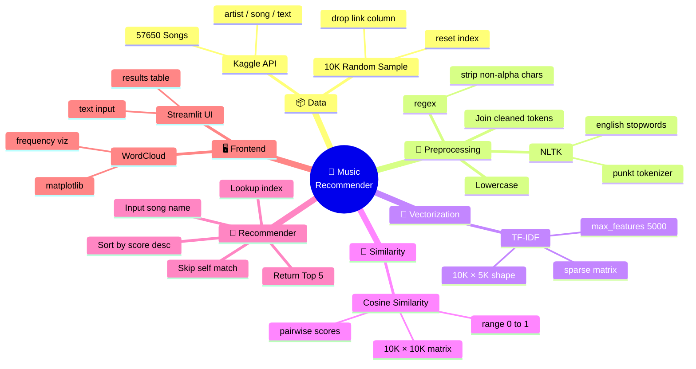
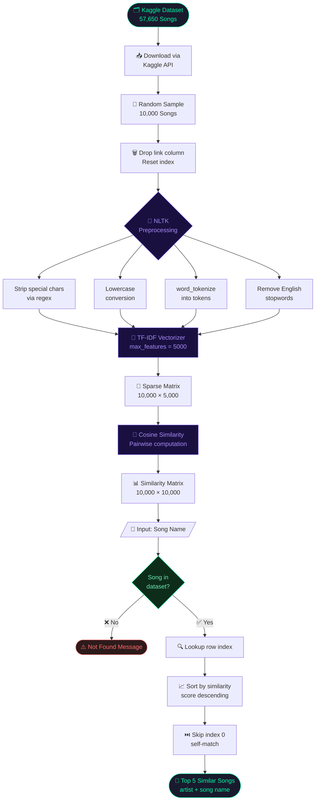
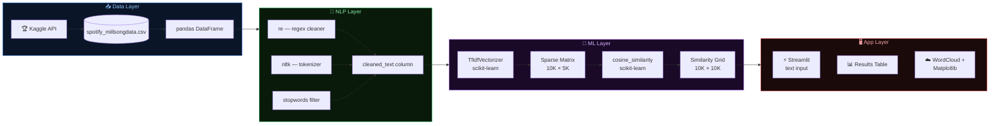
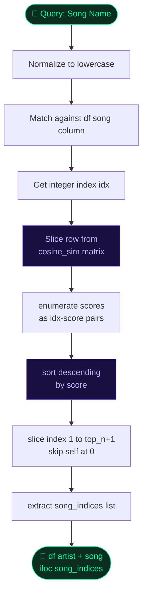
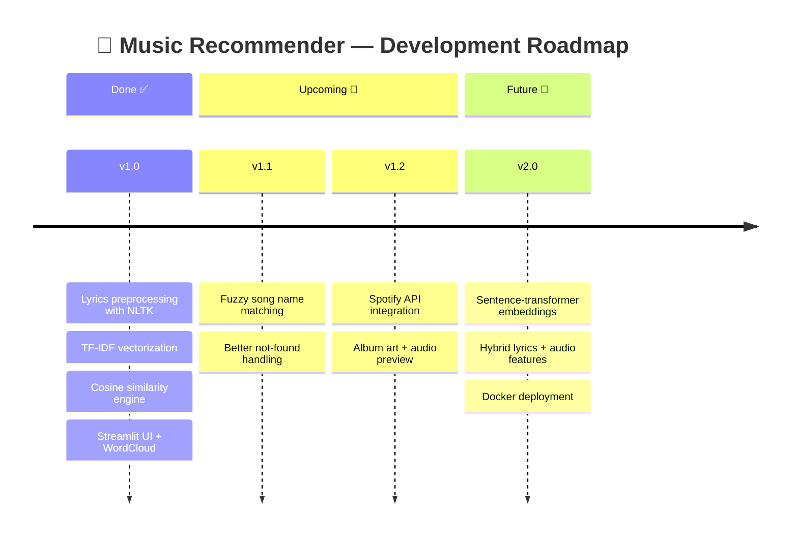

<div align="center">


<br/>


<br/><br/>

[](https://python.org)
[](https://scikit-learn.org)
[](https://streamlit.io)
[](https://nltk.org)
[](https://kaggle.com)
[](https://creativecommons.org/publicdomain/zero/1.0/)

<br/>

[](https://github.com/your-username/music-recommendation-app-python/stargazers)
[](https://github.com/your-username/music-recommendation-app-python/network/members)

</div>

---

## 🌊 Overview

<table>
<tr>
<td width="50%">

### What it does
A **content-based music recommendation system** that analyzes song lyrics using NLP to find musically similar tracks.

- 🎤 Processes **raw lyrics** — not metadata
- 🧹 Cleans text with **NLTK** (regex + stopwords)
- 📐 Vectorizes with **TF-IDF** (5,000 features)
- 🔗 Scores with **Cosine Similarity**
- ⚡ Serves results via **Streamlit**

</td>
<td width="50%">

### Dataset Stats

| Metric | Value |
|--------|-------|
| 🎵 Total Songs | **57,650** |
| 🎲 Model Sample | **10,000** |
| 📐 TF-IDF Features | **5,000** |
| 📊 Similarity Matrix | **10K × 10K** |
| 🏆 Top Artists | Donna Summer, Bob Dylan… |
| 🎯 Output | **Top 5 recommendations** |

</td>
</tr>
</table>

---

## 🗺️ Project Mind Map



---

## 🔬 Pipeline Flow Graph



---

## 🧩 Tech Stack Graph



---

## 🔁 Recommendation Logic Graph



---

## 🚀 Quick Start

<details>
<summary><b>⚙️ Step 1 — Clone the repo</b></summary>
<br/>

```bash
git clone https://github.com/your-username/music-recommendation-app-python.git
cd music-recommendation-app-python
```
</details>

<details>
<summary><b>📦 Step 2 — Install dependencies</b></summary>
<br/>

```bash
pip install -r requirements.txt
```

```
pandas / numpy / scikit-learn / nltk / wordcloud / matplotlib / streamlit / kaggle
```
</details>

<details>
<summary><b>🔑 Step 3 — Set up Kaggle API</b></summary>
<br/>

> Login to Kaggle → Profile Icon → **Settings** → **API** → **Create New Token**

```bash
mkdir ~/.kaggle
cp kaggle.json ~/.kaggle/
chmod 600 ~/.kaggle/kaggle.json
```
</details>

<details>
<summary><b>📥 Step 4 — Download dataset + Run</b></summary>
<br/>

```bash
kaggle datasets download notshrirang/spotify-million-song-dataset
unzip spotify-million-song-dataset.zip
streamlit run app.py
```
</details>

---

## 💡 Example Output

```
Input: "For The First Time"

┌──────────────────────┬────────────────────────┐
│ Artist               │ Song                   │
├──────────────────────┼────────────────────────┤
│ Van Halen            │ Mine All Mine          │
│ The Beatles          │ I Me Mine              │
│ Bob Seger            │ I Wonder               │
│ Nat King Cole        │ Because You're Mine    │
│ Linda Ronstadt       │ He Was Mine            │
└──────────────────────┴────────────────────────┘
```

---

## 📁 Project Structure

```
music-recommendation-app-python/
│
├── 📄 app.py                      ← Streamlit UI
├── 📓 notebook.ipynb              ← Full analysis notebook
├── 📋 requirements.txt            ← Python dependencies
├── 🔑 kaggle.json                 ← API key (DO NOT commit!)
├── 📖 README.md                   ← You are here
│
└── 📁 data/
    └── spotify_millsongdata.csv
```

---

## 🔮 Roadmap



---

## 📜 License

Dataset: [CC0-1.0](https://creativecommons.org/publicdomain/zero/1.0/) via [Kaggle](https://www.kaggle.com/datasets/notshrirang/spotify-million-song-dataset/data)  
Code: [MIT](./LICENSE)

---

<div align="center">


**Built with 🎵 by [your-username](https://github.com/your-username)**

*If this helped you, drop a ⭐ — it means a lot!*

</div>
